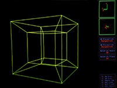
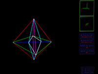
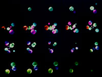

Four-Space Visualization of 4D Objects
====================================================================================================

This repository contains my 1991 thesis (converted to HTML from the original nroff sources), as well
as the original code for my 4D wireframe viewer and my 4D raytracer.

The thesis is now a single all-inclusive HTML file: [_Four-Space Visualization of 4D Objects_][].

See the [`thesis/`][] directory for my thesis source files and associated material.

Wire4
------
[`wire4`][] is my 4D wireframe viewer. It was written to run on an SGI Iris workstation. It
reads in arbitrary 4D wireframes from a simple text file and displays them interactively. The code
has not been maintained, though, and will not run on most modern computers.

Ray4
-----
[`ray4`][] is the updated 4D raytracer, converted to C++. All new features will be created here.

Ray4-c
-------
[`ray4-c`][] is the original 4D raytracer, written in standard C. It can read from standard input
and writes to standard output, so should be able to run on most computers. The output is a 3D RGB
image that can be displayed with a variety of methods. See [`ray4-c/craig/`][craig] for some tools.

GitHub Notes
-------------
You can send any questions to me at [steve@hollasch.net](mailto:steve@hollasch.net). Also, now that
GitHub has a discussions feature, feel free to start a conversation in [the discussions section][].

Other 4D Work
-------------
I'm contacted from time to time by others who have referenced my thesis or are embarking on 4D
visualization work of their own. Here are links to other work I've seen.

- [4D Snake](https://www.youtube.com/watch?v=8IUnqm8j4BE)
- [4+ Dimensional Solid Wireframes](http://utopian-aunt.surge.sh/)

[_Four-Space Visualization of 4D Objects_]: https://hollasch.github.io/ray4/Four-Space_Visualization_of_4D_Objects.html
[the discussions section]:                  https://github.com/hollasch/ray4/discussions/
[`ray4-c`]:                                 ray4-c/README.md
[`ray4`]:                                   ray4/README.md
[craig]:                                    ray4-c/craig/README.md
[`wire4`]:                                  wire4/README.md
[`thesis/`]:                                thesis/README.md
